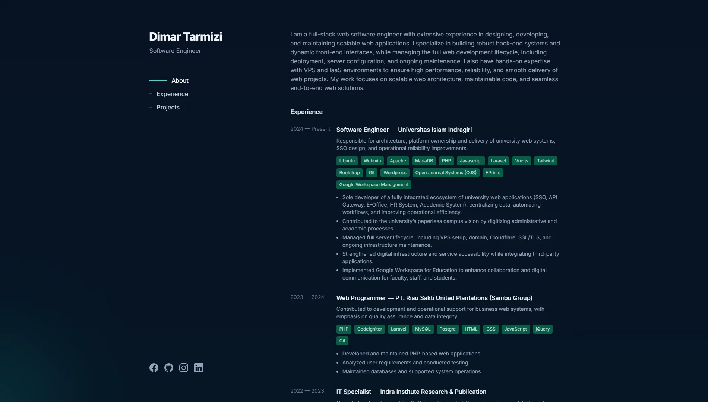

<p align="center">
  
</p>

# Portfolio

[](https://www.php.net/) [](https://laravel.com/) [](https://inertiajs.com/) [](https://vuejs.org/) [](https://vitejs.dev/) [](https://tailwindcss.com/)

Portfolio template built with Laravel 13, Inertia, and Vue 3. This project includes public pages for profile, experience, projects, and blog content, plus an admin panel for managing site content and settings.



## Features

- Portfolio homepage
- Blog listing and post details
- Work experience listing and details
- Project listing and details
- Admin panel for content, projects, posts, experiences, and site settings
- Admin authentication
- Inertia-based forms for experiences, posts, projects, and settings

## Tech Stack

- Laravel 13
- Inertia.js
- Vue 3
- Vite
- Tailwind CSS 4
- Tiptap and Quill for content editing

## Requirements

- PHP 8.2 or newer
- Composer
- Node.js and npm
- A database supported by Laravel

## Installation

1. Clone this repository to your machine.
2. Install PHP and JavaScript dependencies.

```bash
composer install
npm install
```

3. Copy the environment file and generate the application key.

```bash
copy .env.example .env
php artisan key:generate
```

4. Configure your database connection in the .env file.
5. Run migrations and seeders if needed.

```bash
php artisan migrate --seed
```

6. Build the frontend assets or run development mode.

```bash
npm run dev
```

## Running the Project

### Development mode

```bash
composer run dev
```

The command above runs the Laravel server, queue listener, log viewer, and Vite together.

### Production build

```bash
npm run build
```

## Project Structure

- `app/Http/Controllers` contains controllers for public pages and the admin area.
- `app/Http/Requests` contains form validation classes.
- `app/Models` contains the main data models.
- `resources/js/Pages` contains Inertia pages for public and admin views.
- `resources/js/Components` contains reusable UI components.

## Reuse

You are free to use, modify, and adapt this template for your own portfolio or other projects. If you reuse it for public or commercial work, review the content, branding, and security settings before deployment.

## License

This project is released under the MIT License. See [LICENSE](LICENSE) for the full text.
